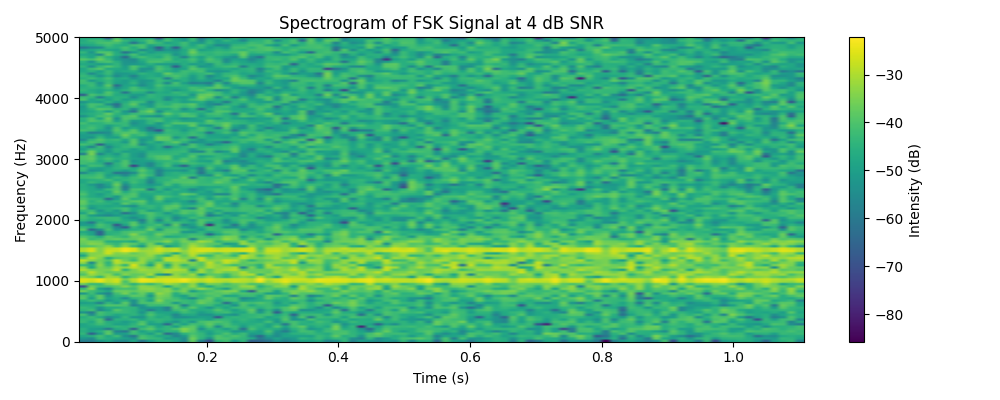
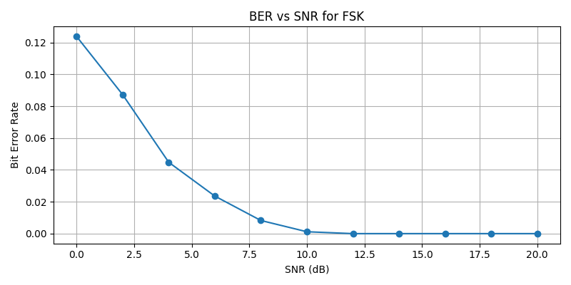

# Multi-Modulation Digital Signal Simulation

This project simulates the transmission, modulation, and decoding of digital signals using **FSK**, **ASK**, and **BPSK** techniques. It includes tools for modulation classification, bit error rate (BER) evaluation, and signal visualization through spectrograms.

---

## Features

- Encode a string into a digital bitstream
- Modulate using Frequency-Shift Keying (FSK), Amplitude-Shift Keying (ASK), or Binary Phase-Shift Keying (BPSK)
- Add Gaussian noise at configurable SNR levels
- Automatically classify modulation type using:
  - Frequency clustering (FSK)
  - Hilbert transform (ASK, BPSK)
- Decode the received waveform based on classification
- Calculate Bit Error Rate (BER)
- Visualize signal characteristics:
  - Spectrogram of the noisy waveform
  - BER vs SNR curve

---

## Limitations

- The bit rate cant go much over 500bps, otherwise frequency artifacts and time–frequency leakage will cause modulation classification to misidentify most signals as **FSK**, regardless of the true type.
- Currently to generate waves of each modulation type, just comment out the other two options.

---

## BER vs SNR Plot

After decoding, the program will run a quick BER test across SNR values from 0 dB to 20 dB in 2 dB steps.

- This test uses the same modulation scheme that was selected in the simulation.
- The resulting **BER vs SNR** plot helps evaluate signal robustness.

---

## Example Workflow

1. Define a message and encode it to bits
2. Select a modulation type (FSK, ASK, or BPSK)
3. Transmit the waveform with noise
4. Classify the modulation type
5. Decode the message
6. Print summary statistics (BER, decoded message, transmission time)
7. Plot:
   - Spectrogram of the noisy signal
   - BER vs SNR for that modulation

---

## Sample Output

SUMMARY REPORT

- Modulation Type: FSK
- Total Bits: 288.0
- Transmission Duration: 0.4799 seconds
- Bit Errors: 0
- Bit Error Rate (BER): 0.00000

--- Message Comparison ---
- Original: Test string showing zero bit errors.
- Decoded : Test string showing zero bit errors.

#### 1. Spectrogram of Noisy Signal  
Shows the frequency content over time. Useful especially for visualizing FSK behavior.

#### 2. BER vs SNR Curve  
Evaluates decoding performance across increasing noise levels.

---

## 🚀 Future Improvements

- **Multi-Modulation Streams:**  
  Combine segments with different modulation types into a single transmission and detect transitions dynamically.

- **Noise Robustness:**  
  Improve classification and decoding under extremely low SNR (e.g. < 0 dB) with techniques like filtering or Bayesian classification.

- **GUI Front-End (Optional):**  
  Interactive interface to select parameters and view decoded output live.

---
